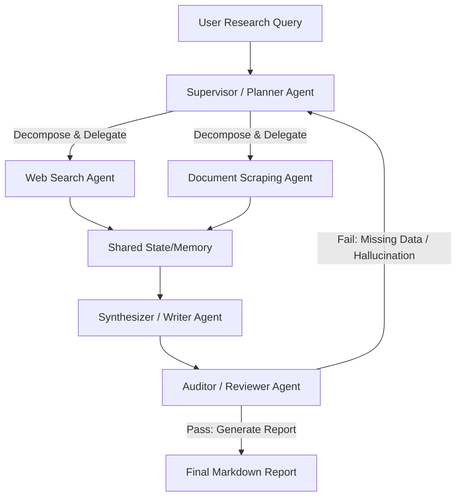

# Autonomous Multi-Agent Deep Research System

An enterprise-grade, multi-agent orchestration system that automates deep topical research, real-time web intelligence harvesting, and evidence-based synthesis. Built using a hierarchical state-machine architecture, the system coordinates specialized AI agents to crawl, validate, audit, and compile comprehensive, citation-backed intelligence reports with zero human intervention.


## 🚀 Key Features & Architectural Highlights

- **Hierarchical Agent Coordination**: Implements a Supervisor-Worker topology to dynamically decompose complex research queries into parallelizable sub-tasks.
- **Self-Correcting Critique Loop**: A dedicated Auditor/Reviewer Agent evaluates generated reports against factuality and structural constraints, automatically triggering sub-agents to fill information gaps.
- **Deterministic Tool Execution**: Custom-built integration with neural search engines (Tavily/Exa) and web scrapers with automatic retry mechanisms and rate-limit handling.
- **Strict Grounding & Automated Citation**: Enforces absolute data grounding to eliminate LLM hallucinations; every statement in the final report maps back to a validated URL footprint.
- **State Management & Resiliency**: Built on state machines to ensure conversation context tracking and graceful error recovery during long-horizon research tasks.

## 🛠️ Tech Stack & Ecosystem

- **Framework & Orchestration:** Python 3.11+, LangGraph / CrewAI (State Management)
- **Core LLM Engines:** OpenAI GPT-4o / Anthropic Claude 3.5 Sonnet / Groq (Llama 3)
- **Data Harvesting & Search:** Tavily API, BeautifulSoup4, Exa AI
- **Frontend / Interface:** Streamlit (Custom styled UI with real-time process logs)
- **DevOps & Infrastructure:** Docker, GitHub Actions (CI/CD)

## 📐 System Architecture

The core architecture leverages a State Graph to handle multi-agent message transitions and shared global memory:


## ⚙️ Setup and Installation

### Prerequisites
- **Python:** 3.10 or 3.11
- **API Keys:** OpenAI or Anthropic API Key, and a Tavily Search API Key

---

### Local Deployment

#### 1. Clone the Repository
```bash
git clone [https://github.com/shreyakoranga80-hash/Multi-Agent-Research-System.git](https://github.com/shreyakoranga80-hash/Multi-Agent-Research-System.git)
cd Multi-Agent-Research-System

